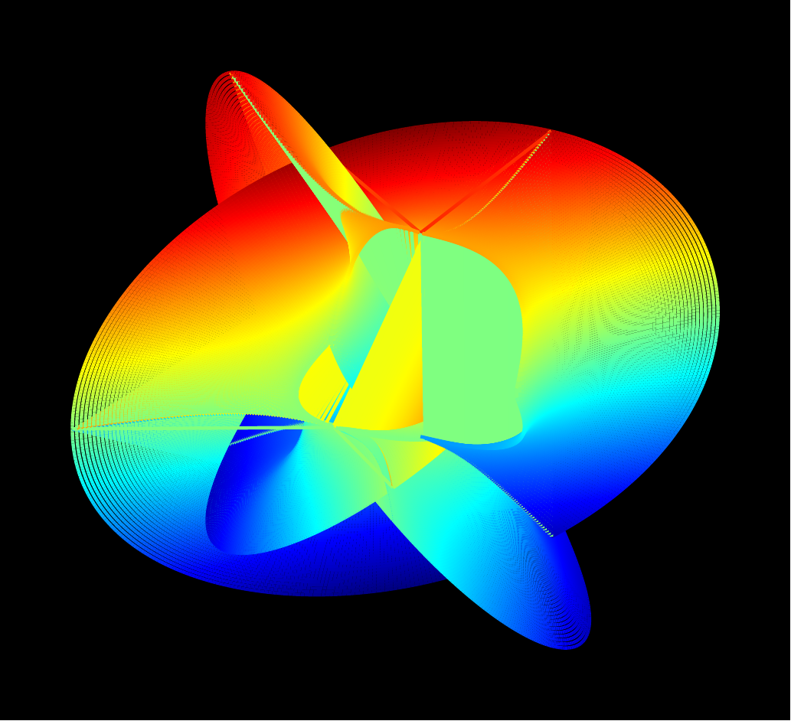

# CY3d

[](https://github.com/rice8y/CY3d/actions/workflows/CI.yml?query=branch%3Amain)

This LaTeX package provides a command `\CalabiYau`, which can display Calabi-Yau manifold. This package utilizes PGFplots for drawing Calabi-Yau manifold.

<p align="center" width="100%">
    
</p>

## Requirements

This package requires `pgfplots` and `luacode`. Additionally, since Lua is used for coordinate calculations, LuaLaTeX must be used.

## Installation

To install this package, you can clone the repository from GitHub:
```bash
git clone https://github.com/rice8y/cy3d
cd cy3d
```

### Windows

On Windows, you can run the batch script with optional flags:
```bash
install.bat [--texmflocal|--texmfhome]
```

- `--texmflocal`: Install into TEXMFLOCAL (requires administrator privileges, default)
- `--texmfhome`: Install into TEXMFHOME (user local tree, no administrator privileges required)

### Linux/macOS

For Linux and macOS, you can use the shell script with optional flags:
```bash
./install.sh [--texmflocal|--texmfhome]
```

- `--texmflocal`: Install into TEXMFLOCAL (requires sudo, default)
- `--texmfhome`: Install into TEXMFHOME (user local tree, no sudo required)

**Note:** Installing to TEXMFHOME is recommended for single-user installations as it doesn't require elevated privileges and is automatically indexed by TeX Live without running `mktexlsr`.

## Usage

```tex
\CalabiYau[colormap]{power}{angle}{mesh size}
```

**Parameters:**

 - power: The degree (or exponent) of the Calabi-Yau equation $z_{1}^{n}+z_{2}^{n}=1$.
 - angle: The angle parameter to adjust the rotation or perspective of the surface.
 - mesh size: Defines the resolution of the mesh for plotting the surface.
 - colormap (option): Specifies the color scheme used for rendering the surface. This is based on the TikZ colormap. The default colormap is jet.

## License

This package is distributed under the BSD 2-Clause License. See [LICENSE](LICENSE).